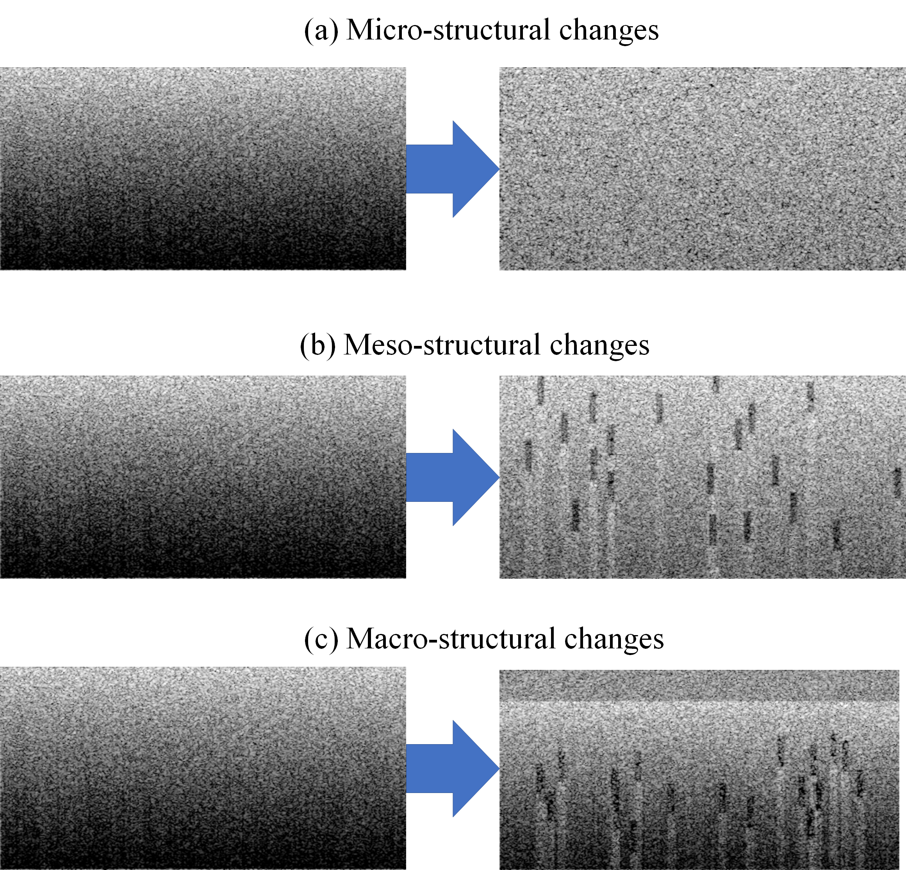
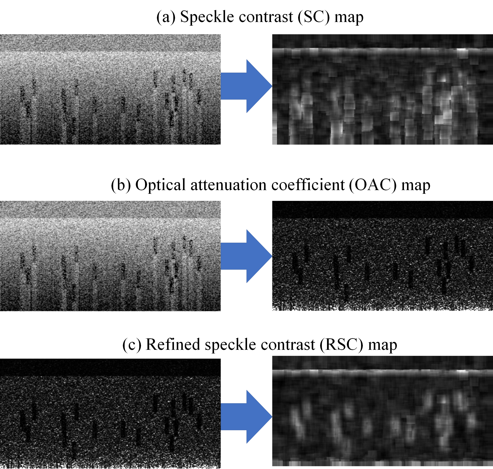
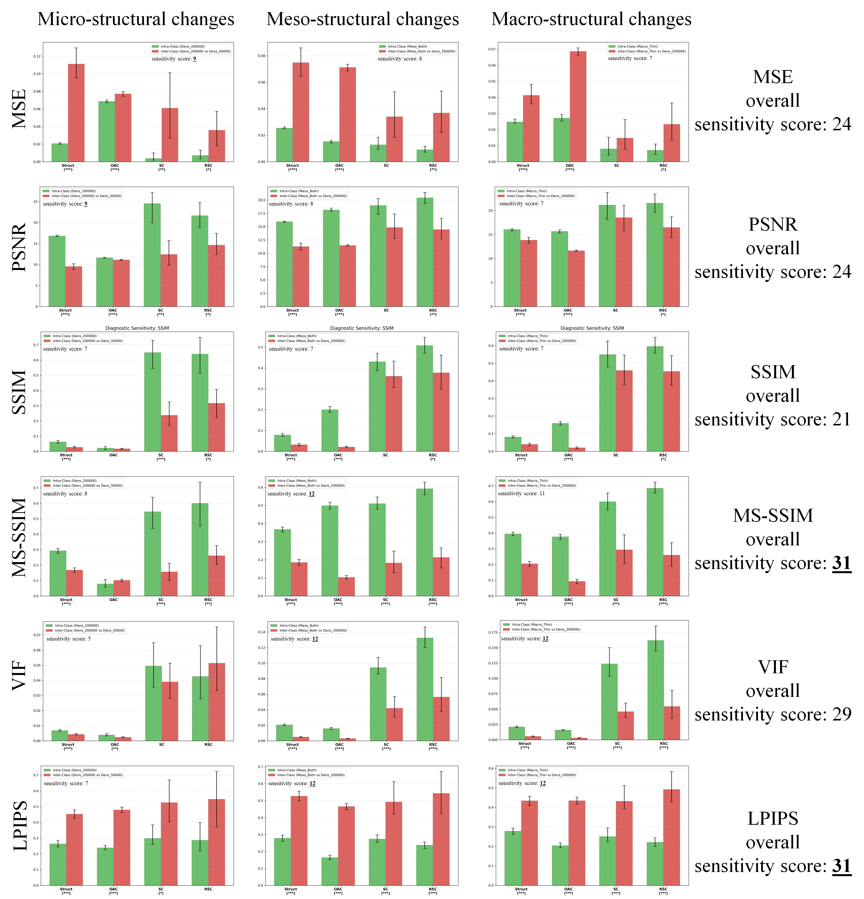

# Benchmarking OCT Scans Similarity Metrics

**Physics-Based Simulatory Analysis with Controlled Micro-, Meso-, and Macro-Structural Shifts**

This repository contains the evaluation scripts and results for the paper submitted to **MICCAI 2026**. It provides tools to benchmark similarity metrics (MSE, PSNR, SSIM, MS-SSIM, VIF, LPIPS) on synthetic OCT B-scans with strictly controlled structural parameters.

## 📂 Dataset

The synthetic dataset used for this benchmark is hosted on Zenodo. It includes Ground Truth scatterer maps, structural OCT scans, and physics-based parametric maps (OAC, SC, RSC) via [Processor](https://github.com/SynthOCTChallenge/SynthOCT_Baseline/blob/main/Part3_Processor.py).

[](https://doi.org/10.5281/zenodo.18670884)

**[Download Dataset from Zenodo](https://zenodo.org/records/18670884)**

### Structural Levels
The benchmark covers three scales of structural changes:
1.  **Micro-structure:** Sensitivity to sub-resolution scatterer density and amplitude statistics.
2.  **Meso-structure:** Sensitivity to discrete inclusions (cysts, vessels) on a speckle background.
3.  **Macro-structure:** Sensitivity to morphological layer thickness changes on a heterogeneous background.

---

##  🚀 Repository Structure

```text
├── Metrics_evaluation/
│   ├── Metrics_Stats_CSV.zip           # Pre-calculated metric statistics (Raw Data)
│   ├── Metric_Performance_Test_v5_MicroMesoMacro_Empirical.py   # Main script for calculating metrics
│   ├── Metrics_Plots_with_Intervals_and_SignificanceLevel.py      # Script for generating publication-ready plots
│   └── Illustrations.png   # Synth OCT scan examples
│   └── Physics_maps.png   # physics-based maps
│   └── Resutls.png   # Metrics evaluation results
│   └──  README.md
```

## 📊 Evaluation Methodology
We evaluate metrics based on their Diagnostic Sensitivity, defined as the statistical separation between:

Intra-class Baseline: The metric distribution when comparing different realizations of the same tissue structure (speckle noise only); representing the ultimate reachable similarity level in speckled conditions for the same structural patterns.

Inter-class Target (Signal): The metric distribution when comparing the baseline tissue to a structurally altered tissue.

Significance Levels (Stars)

(*): 95% empirical intervals are separated (<5% overlap).

(** ): 100% ranges (min-max) are fully separated.

(*** ): Robust separation (Gap > Sum of Standard Deviations).

## Simulation of Structural Shifts
<p align="center">

 Visualization of the synthetic datasets representing three scales of structural changes: (a) Micro-structure (scatterer density), (b) Meso-structure (inclusions), and (c) Macro-structure (layered morphology).


## Physics-Based Parametric Maps
<p align="center">
 
Physics-based parametric maps derived from synthetic OCT B-scans. (a) Speckle Contrast (SC) map: Characterizes microstructural inhomogeneities but remains confounded by depth-dependent signal attenuation; (b) Optical Attenuation Coefficient (OAC) map: Provides a pixel-level representation of the backscattering energy distribution within each spatially resolved volume; (c) Refined Speckle Contrast (RSC) map: Calculated directly from the OAC map to reveal the pure inhomogeneity of the scatterer distribution, independent of in-depth attenuation artifacts. Together, OAC and RSC provide a physics-consistent and spatially resolved characterization of tissue structure.


## Metric Performance Results
<p align="center">
 
Metric performance results grouped by the type of structural changes (Micro-, Meso-, and Macro-structure). The diagnostic sensitivity is estimated as the separation between the intra-class baseline distribution (green bars), representing the ultimate reachable similarity level in speckled conditions for the same structural patterns, and the inter-class target distribution (red bars) representing structural shifts. Significance levels denote the separation of empirical value ranges: no star indicates overlapping ranges; (* ) indicates separation of the 95% empirical intervals (<5% overlap); (** ) indicates fully separated ranges (100% min-max separation); and (*** ) indicates robust separation where the gap between distributions exceeds the sum of their standard deviations. MS-SSIM and LPIPS achieved the highest overall sensitivity scores (31). These metrics demonstrated superior consistency across all scales, particularly excelling in detecting meso- and macro-structural anomalies, and proved highly effective on physics-consistent maps (OAC and RSC) even for micro-structural shifts (e.g., LPIPS achieved *** on OAC and MS-SSIM achieved ** on RSC, matching the high sensitivity of MSE/PSNR while offering better structural specificity).


## 🛠️ Usage

1. Calculate Metrics
 
To re-run the metric calculations on the dataset:

Download the dataset from Zenodo and extract it to Dataset/.

Run the analysis script:

Metric_Performance_Test_v5_MicroMesoMacro_Empirical.py

Note: You may need to edit the INPUT_DIR variable in the script to point to specific subfolder

2. Generate Plots
   
To generate the bar charts with significance stars from the provided CSVs:

Metrics_Plots_with_Intervals_and_SignificanceLevel.py

Note: The metric statistics are already calculated and provided in this repository. You do not need to re-run the heavy computation to reproduce the figures.
Unzip Metrics_Stats_CSV.zip. Ensure the extracted folder is named Metrics_Stats_CSV and is located in the same directory as the scripts.

Run the plotting script


## 📚 Citation

If you use this code or dataset, please cite the following works:

Dataset:

[Link to Zenodo Record](https://zenodo.org/records/18670884)

Methodology:
```text
 [1] Sovetsky, A., Matveyev, A., Chizhov, P., Zaitsev, V., Matveev, L. (2025). OCT Scans Simulation Framework for Data Augmentation and Controlled Evaluation of Signal Processing Approaches. In: Fernandez, V., et al. (eds) Simulation and Synthesis in Medical Imaging. SASHIMI 2024. LNCS, vol 15187. Springer, Cham. https://doi.org/10.1007/978-3-031-73281-2_12
```
```text
 [2] Nikoshin, D., Mikhailenko, D., Sovetsky, A., Matveyev, A., Zaitsev, V., Matveev, L. (2026). From Tissue-Mimicking Phantoms to Physics-Based Scans: Synthetic OCT for Few-Shot Foundation Model Training. In: Fernandez, V., et al. (eds) Simulation and Synthesis in Medical Imaging. SASHIMI 2025. LNCS, vol 16085. Springer, Cham. https://doi.org/10.1007/978-3-032-05573-6_5
```
```text
 [3] MICCAI 2026 submission (will be available soon)
```
