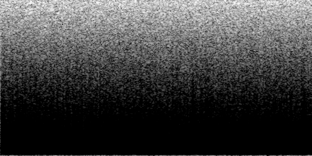
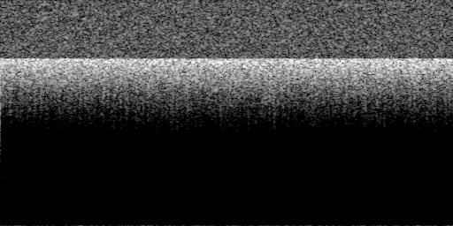
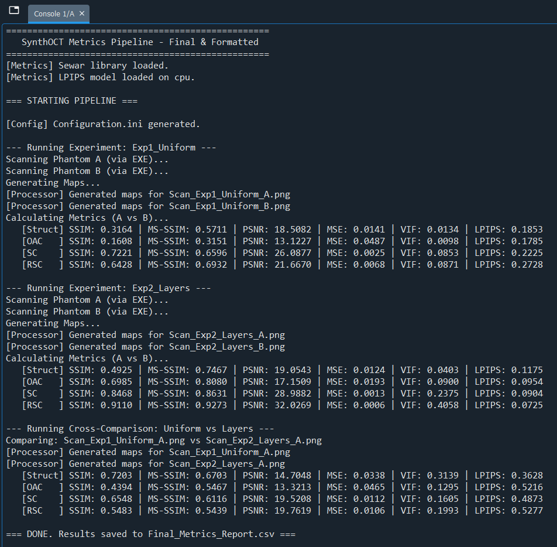

# Self-Consistency Check & Baseline Results

This folder contains the artifacts generated by running the **SynthOCT Baseline Pipeline** (`Orchestrator.py`). 

The baseline performs a **Self-Consistency Check** to demonstrate the behavior of the evaluation metrics. It simulates two scenarios:
1.  **Uniform Phantom (Exp1):** A homogeneous tissue medium (Two generations, A and B, under the same governing parameters of the scattering distribution).
2.  **Layered Phantom (Exp2):** A tissue with a distinct hyper-scattering layer (Two generations, A and B, under the same governing parameters of the scattering distribution).

The pipeline compares different random realizations of the *same* phantom to establish a baseline for speckle noise, and then performs a **Cross-Comparison** (Uniform vs. Layered) to verify that the metrics correctly identify structural differences.

---

## 1. Visual Results

### Synthetic B-Scans
Below are the raw OCT B-scans generated by the `Part2_Scanner.exe`.

| Experiment 1: Uniform Phantom | Experiment 2: Layered Phantom |
| :---: | :---: |
|  |  |
| *Homogeneous distribution of scatterers.* | *Includes a highly scattering layer at ~400μm.* |

---

## 2. Execution Log
The following screenshot demonstrates the successful execution of the pipeline, showing the step-by-step generation, scanning, and metric calculation process.

---

## 3. Quantitative Metrics (`Final_Metrics_Report.csv`)

The table below summarizes the metrics calculated across the three comparison modes.

**Key Observations:**
*   **Self-Comparison (Exp2):** High **MS-SSIM for all maps** (>0.7), **SSIM for SC and RSC** (>0.8) and Low **LPIPS for all maps** (<0.2) indicate the scans with meso/macro-structure are statistically identical despite speckle variations.
*   **Cross-Comparison (Uniform vs. Layers):** **MS-SSIM for all maps** significantly decreases (<0.7), **SSIM for OAC, SC and RSC** significantly decreases (<0.7), and **LPIPS for all maps** significantly increases (~0.36-0.52), confirming that the metrics successfully detect the structural and physics-based parametric difference between the two phantom types.

| Experiment | Map Type | SSIM | MS-SSIM | PSNR | MSE | VIF | LPIPS |
| :--- | :--- | :--- | :--- | :--- | :--- | :--- | :--- |
| **Exp1_Uniform** | **Struct** | 0.3164 | 0.5711 | 18.51 | 0.0141 | 0.0134 | 0.1853 |
| **(Self-Check)** | **OAC** | 0.1608 | 0.3151 | 13.12 | 0.0487 | 0.0098 | 0.1785 |
| **No meso/macro-structure**| **SC** | 0.7221 | 0.6596 | 26.09 | 0.0025 | 0.0853 | 0.2225 |
| | **RSC** | 0.6428 | 0.6932 | 21.67 | 0.0068 | 0.0871 | 0.2728 |
| **Exp2_Layers** | **Struct** | 0.4925 | 0.7467 | 19.05 | 0.0124 | 0.0403 | 0.1175 |
| **(Self-Check)** | **OAC** | 0.6985 | 0.8080 | 17.15 | 0.0193 | 0.0900 | 0.0954 |
| **With meso/macro-structure**| **SC** | 0.8468 | 0.8631 | 28.99 | 0.0013 | 0.2375 | 0.0904 |
| | **RSC** | 0.9110 | 0.9273 | 32.03 | 0.0006 | 0.4058 | 0.0725 |
| **Cross-Comparison**| **Struct** | 0.7203 | 0.6703 | 14.70 | 0.0338 | 0.3139 | 0.3628 |
| **(Uniform vs Layers)**| **OAC** | 0.4394 | 0.5467 | 13.32 | 0.0465 | 0.1295 | 0.5216 |
| | **SC** | 0.6548 | 0.6116 | 19.52 | 0.0112 | 0.1605 | 0.4873 |
| | **RSC** | 0.5483 | 0.5439 | 19.76 | 0.0106 | 0.1993 | 0.5277 |

*Note: Detailed raw data is available in [Final_Metrics_Report.csv](Final_Metrics_Report.csv).*
